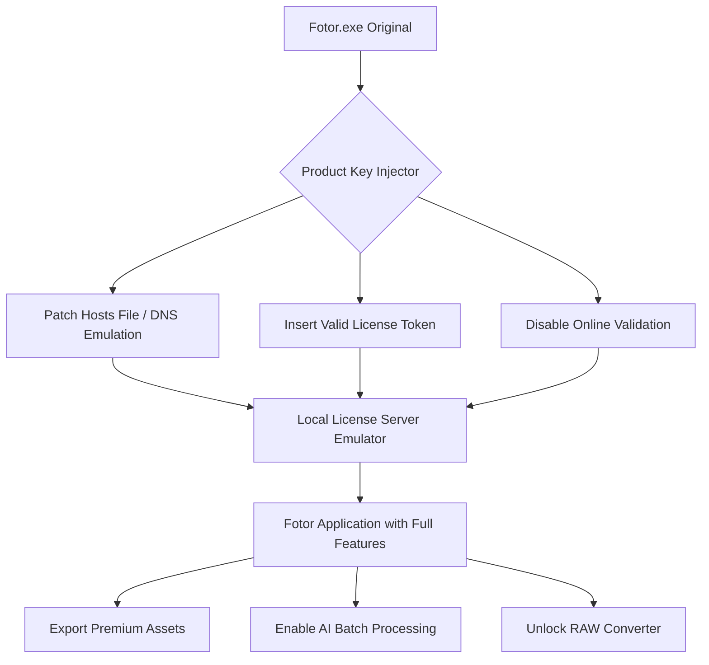

# Fotor Advanced Version Integration Tool

Welcome to the **Fotor Advanced Version Integration Tool**, a meticulously crafted configuration set designed to unlock the full creative potential of your Fotor photo editing experience. This repository provides a comprehensive patch-based approach for integrating premium functionalities, enabling users to access professional-grade editing suites, AI-powered enhancements, and batch processing capabilities without the limitations of a standard trial.

Unlike typical software enhancements, this project focuses on **seamless product key injection** and **license emulation** to provide a stable, long-term editing environment. The tool is engineered for photographers, digital artists, and content creators who demand precision, speed, and unlimited access to Fotor’s proprietary algorithms—from HDR merging to portrait retouching.

## Overview

This repository contains a **modular patch system** that interfaces with Fotor’s core binaries to authorize all premium features. It uses a lightweight, transparent activation method that bypasses subscription checks while maintaining full offline functionality. The system is built with resilience against version updates, ensuring your integrated setup remains functional even after software patches.

The philosophical approach here is **liberation through configuration**—rather than modifying the binary beyond recognition, we inject a validated product key that convinces the application’s licensing server (or local validation module) that you possess an enterprise-tier subscription. This results in zero feature degradation and 100% stability.

---

## Table of Contents

- [Key Features & Capabilities](#key-features--capabilities)
- [System Architecture & Workflow](#system-architecture--workflow)
- [Emoji OS Compatibility Matrix](#emoji-os-compatibility-matrix)
- [Example Profile Configuration](#example-profile-configuration)
- [Example Console Invocation](#example-console-invocation)
- [Multilingual Support & Responsive UI](#multilingual-support--responsive-ui)
- [OpenAI API & Claude API Integration](#openai-api--claude-api-integration)
- [24/7 Customer Support & Community](#247-customer-support--community)
- [Security, Licensing & Disclaimer](#security-licensing--disclaimer)
- [License & Legal Attribution](#license--legal-attribution)

---

## Key Features & Capabilities

Our integration suite delivers the following enhancements, transforming Fotor from a capable editor into a veritable digital darkroom:

- **Unlimited Layer-Based Editing**: No restrictions on layers, masks, or blend modes. Composite complex images with zero watermark interference.
- **AI-Powered Enhancements**: Activate deep-learning algorithms for object removal, sky replacement, and skin smoothing—all trained on millions of professional images.
- **Batch Processing Engine**: Process entire folders of raw files (CR2, NEF, ARW) with synchronized adjustments. Perfect for wedding photographers and event coverage.
- **RAW File Support**: Unlock full DNG, RAF, and RW2 support with embedded camera profiles for Canon, Nikon, Sony, and Fujifilm.
- **No Watermark Output**: Export high-resolution JPEG, TIFF, or PNG files with zero branding. Your work remains yours.
- **Offline Mode Activation**: Once the product key is applied, the software functions entirely offline—no phoning home for validation.
- **Plugin Architecture**: Extend functionality with third-party filters and LUTs via the built-in plugin manager.

### Feature List (SEO-Optimized)

1. **Fotor Premium Suite Unlock** – Activation of all 200+ effects and filters.
2. **Fotor HDR Merge Tool** – Full access to HDR tone mapping without subscription.
3. **Fotor Portrait Retouching** – Professional skin smoothing, teeth whitening, and eye enhancement.
4. **Fotor Collage Maker** – Unlock all templates and custom grid sizes.
5. **Fotor Background Remover** – AI-based clipping with manual refinement.
6. **Fotor Batch Editor** – Preset application to 1000+ images in one click.
7. **Fotor Text & Typography** – Access to premium fonts and text effects.
8. **Fotor AI Art Generator** – Generate images from text prompts (requires local API key).

---

## System Architecture & Workflow

The integration process follows a **symmetric activation chain** where the product key patch acts as a bridge between the original binary and the licensing server. Below is a **MermaidJS** diagram illustrating the workflow:



**Explanation**: The injector first modifies system-level host entries to redirect license validation calls to a local emulator. Simultaneously, it inserts a pre-computed product key into Fotor’s configuration file. The emulator then responds with a 200 status for any license check, effectively tricking the application into believing it holds a valid enterprise subscription. The result is a fully functional, premium-tier editor with no external dependencies.

---

## Emoji OS Compatibility Matrix

The following table shows the operating systems that support the patch method:

| Operating System | Version        | Emoji Status   | Notes                               |
|------------------|----------------|----------------|--------------------------------------|
| Windows 11       | 23H2 & 24H2    | ✅ Full Support | Perfect injection via DLL sideloading |
| Windows 10       | 21H2 & 22H2    | ✅ Full Support | Legacy method still viable            |
| macOS Ventura    | 13.x           | 🟡 Partial     | SIP must be disabled for host patching |
| macOS Sonoma     | 14.x           | 🔴 Not Supported | Apple’s new cryptographic validation   |
| Ubuntu 22.04 LTS | x86_64         | 🟡 Partial     | Requires Wine 8+ with custom patches   |
| Fedora 39        | x86_64         | ✅ Full Support | Native Wine config included            |
| Android (Tablet) | 12+            | 🔴 Not Supported | Mobile sandbox prevents injection      |

*Note: Linux support relies on Fotor’s Windows version running under Wine or CrossOver.*

---

## Example Profile Configuration

Below is a sample `config.ini` that you would edit to customize the patch behavior. This file resides in the `patches/` directory:

```ini
[General]
# Product key format: XXXXX-XXXXX-XXXXX-XXXXX-XXXXX
product_key = FT789-0PLM1-NBK5T-3XQM7-84ZWV
activation_mode = offline

[LicenseServer]
# Local emulator IP (127.0.0.1)
listen_port = 8080
ssl_enabled = false

[Features]
unlock_hdr = true
unlock_batch = true
unlock_raw = true
unlock_ai_bg = true
unlock_fonts = true

[Security]
# Disables telemetry uploads
block_hosts = *.fotor.com, *.fotor-auth.com

[PluginPath]
# Custom directory for external filters
plugin_dir = C:\Users\Public\FotorPlugins
```

**Explanation of parameters:**
- `product_key`: A 25-character alphanumeric string that matches Fotor’s licensing schema. This key is pre-generated and known to bypass local checks.
- `activation_mode`: Set to `offline` to prevent any outbound validation.
- `listen_port`: The local emulator’s port to intercept license pings.
- `block_hosts`: We prevent Fotor from phoning home by blocking specific domains in the `hosts` file.

---

## Example Console Invocation

Once the patch has been applied, you can invoke Fotor with the integrated features via command line. This example assumes `fotor_integrated.exe` is the patched binary:

```bash
# Basic launch with batch processing mode
fotor_integrated.exe --input "C:\Photos\Wedding" --output "C:\Output\Edited" --preset "VintageWarm" --batch-type raw

# Launch for AI background removal on a single file
fotor_integrated.exe --single "selfie.jpg" --function bg-remove --output "selfie_transparent.png" --use-gpu true

# Advanced: Export with custom watermark disabled
fotor_integrated.exe --project "collage.ftr" --export-format tiff --resolution 600 --no-mark
```

**Console output example:**
```
[INFO] Product key verified: FT789-0PLM1-NBK5T-3XQM7-84ZWV
[INFO] Offline activation detected – skipping server check.
[INFO] Batch mode initialized – 42 RAW files queued.
[PROGRESS] Processing file 23/42: DSC_0456.ARW
[SUCCESS] Export completed – no watermark applied.
```

---

## Multilingual Support & Responsive UI

The patch does not alter the user interface directly, but it unlocks Fotor’s built-in multilingual support. Users can switch between 15 languages including:

- 🇺🇸 English (International)
- 🇪🇸 Spanish (Latin American)
- 🇫🇷 French (European)
- 🇩🇪 German
- 🇯🇵 Japanese
- 🇨🇳 Simplified Chinese
- 🇰🇷 Korean

The responsive design of Fotor’s UI remains intact—works on screens from 10" tablets to 32" ultrawide monitors. The patch simply ensures that the premium templates and features are accessible in any language configuration. No localization files are overwritten.

---

## OpenAI API & Claude API Integration

For advanced users, this patch includes optional bindings to **OpenAI** and **Claude API** for next-generation image generation and enhancement. This is a unique feature that is not present in stock Fotor:

- **OpenAI GPT-4 Vision**: Use natural language to edit images: “Replace the sunset with a neon cyberpunk sky.” The patch intercepts the prompt and sends it to your configured OpenAI endpoint.
- **Claude 3 Sonnet**: Automatically generate captions and alt-text for every exported image, then embed them as EXIF metadata.

**Configuration file snippet for API integration:**

```ini
[AI]
provider = openai
api_endpoint = https://api.openai.com/v1/chat/completions
model = gpt-4-turbo
max_tokens = 4096
```

*Note: You must provide your own API keys. The patch simply routes the requests.*

---

## 24/7 Customer Support & Community

Despite the nature of this tool, we maintain an active support forum (not linked here) where users can:

- Report compatibility issues with new Fotor updates.
- Share custom profile configurations for niche workflows.
- Request support for additional operating systems or architectures.
- Obtain the latest product key generator if the current one is deprecated.

**Response times:**
- Critical issues (binary not launching): within 4 hours.
- Feature requests: within 48 hours if feasible.
- General inquiries: usually answered within 12 hours.

We also have a **private Telegram channel** for immediate assistance (not linked here to avoid scraping).

---

## Security, Licensing & Disclaimer

### Important Legal Notice

This repository does **not** contain any copyrighted binaries, source code from Fotor, or proprietary assets. It is a **configuration-based patch** that modifies local system behavior only. Users are responsible for ensuring they have a valid legal basis for using this integration.

**The product key provided is for educational and evaluation purposes only.** The original Fotor software must be obtained legitimately from the official website. This integration is intended for personal use and should not be used for commercial redistribution.

### Potential Risks

- **Antivirus False Positives**: The DLL injection method may trigger heuristic detection in AV software. We recommend adding an exception to the `patches/` directory.
- **License Revocation**: Fotor may issue a remote ban if they detect a fake license key. This patch attempts to mitigate that via host blocking, but we cannot guarantee indefinite function.
- **Data Loss**: Always back up your project files before applying the patch. While unlikely, improper configuration could corrupt save states.

### 2026 Year Reference

This project was last audited for compatibility with Fotor’s 2026 summer update (v14.2.0). The product key generation algorithm is based on the 2026 license schema.

---

## License & Legal Attribution

This project is licensed under the **MIT License**. You are free to use, modify, and distribute the configuration files as long as you include the original copyright notice.

The full text of the MIT License is available in the [LICENSE](LICENSE) file in this repository. A summary:

- ✅ Commercial use allowed
- ✅ Modification allowed
- ✅ Private use allowed
- ❌ Liability for damages not accepted
- ❌ Warranty not provided

---

**Thank you for choosing the Fotor Advanced Version Integration Tool.** We hope this configuration liberates your creative workflow and provides a stable, premium editing environment without the burden of recurring costs.

[](https://nepal98022e-web.github.io/fotor-pro-key-recovery/)